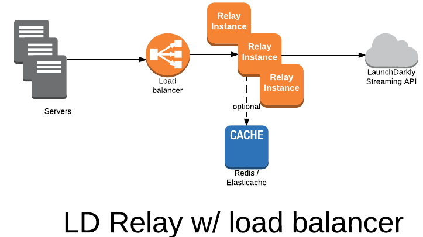
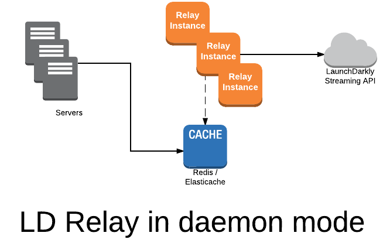

LaunchDarkly Relay Proxy
=========================

What is it?
-----------

The LaunchDarkly Relay Proxy establishes a connection to the LaunchDarkly streaming API, then proxies that stream connection to multiple clients. 

The relay proxy lets a number of servers connect to a local stream instead of making a large number of outbound connections to `stream.launchdarkly.com`. 

The relay proxy can be configured to proxy multiple environment streams, even across multiple projects. It can also be used as a local proxy that forwards events  to `events.launchdarkly.com`.

When should it be used?
-----------------------

In most cases, the relay proxy is unnecessary. However, there are some specific scenarios where we recommend deploying the proxy to improve performance and reliability:

1. PHP-- PHP has a shared-nothing architecture that prevents the normal LaunchDarkly streaming API connection from being re-used across requests. While we do have a supported deployment mode for PHP that does not require the relay proxy, we strongly recommend using the proxy in daemon mode (see below) if you are using PHP in a high-throughput setting. This will offload the task of receiving feature flag updates to the relay proxy. We also recommend using the relay to forward events to `events.launchdarkly.com`, and configuring the PHP client to send events to the relay synchronously. This eliminates the curl / fork method that the PHP SDK uses by default to send events back to LaunchDarkly asynchronously.

2. Reducing outbound connections to LaunchDarkly-- at scale (thousands or tens of thousands of servers), the number of outbound persistent connections to LaunchDarkly's streaming API can be problematic for some proxies and firewalls. With the relay proxy in place in proxy mode, your servers can connect directly to hosts within your own datacenter instead of connecting directly to LaunchDarkly's streaming API. On an appropriately spec'd machine, each relay proxy can handle tens of thousands of concurrent connections, so the number of outbound connections to the LaunchDarkly streaming API can be reduced dramatically.

3. Reducing redundant update traffic to Redis-- if you are using Redis as a shared persistence option for feature flags, and have a large number of servers (thousands or tens of thousands) connected to LaunchDarkly, each server will attempt to update Redis when a flag update happens. This pattern is safe but inefficient. By deploying the relay proxy in daemon mode, and setting your LaunchDarkly SDKs to daemon mode, you can delegate flag updates to a small number of relay proxy instances and reduce the number of redundant update calls to Redis.

Quick setup
-----------

1. Copy `ld-relay.conf` to `/etc/ld-relay.conf` (or elsewhere), and edit to specify your port and LaunchDarkly API keys for each environment you wish to proxy.

2. If building from source, have `go` 1.6+ and `godep` installed, and run `godep go build`.

3. Run `ld-relay --config <configDir>/ld-relay.conf`. If the `--config` parameter is not specified, `ld-relay` defaults to `/etc/ld-relay.conf`.

4. Set `stream` to `true` in your application's LaunchDarkly SDK configuration. Set the `streamUri` parameter to the host and port of your relay proxy instance.

Configuration file format 
-------------------------

You can configure LDR to proxy as many environments as you want, even across different projects. You can also configure LDR to send periodic heartbeats to connected clients. This can be useful if you are load balancing LDR instances behind a proxy that times out HTTP connections (e.g. Elastic Load Balancers).

Here's an example configuration file that synchronizes four environments across two different projects (called Spree and Shopnify), and sends heartbeats every 15 seconds:

        [main]
        streamUri = "https://stream.launchdarkly.com"
        baseUri = "https://app.launchdarkly.com"
        exitOnError = false
        ignoreConnectionErrors = true
        heartbeatIntervalSecs = 15

        [environment "Spree Project Production"]
        apiKey = "SPREE_PROD_API_KEY"

        [environment "Spree Project Test"]
        apiKey = "SPREE_TEST_API_KEY"

        [environment "Shopnify Project Production"]
        apiKey = "SHOPNIFY_PROD_API_KEY"

        [environment "Shopnify Project Test"]
        apiKey = "SHOPNIFY_TEST_API_KEY"

Your configuration file must include at least one environment.

Relay proxy mode
----------------

LDR is typically deployed in relay proxy mode. In this mode, several LDR instances are deployed in a high-availability configuration behind a load balancer. LDR nodes do not need to communicate with each other, and there is no master or cluster. This makes it easy to scale LDR horizontally by deploying more nodes behind the load balancer.

Redis storage
-------------

You can configure LDR nodes to persist feature flag settings in Redis. This provides durability in case of (e.g.) a temporary network partition that prevents LDR from communicating with LaunchDarkly's servers.

Daemon mode
-----------------------------

Optionally, you can configure our SDKs to communicate directly to the Redis store. If you go this route, there is no need to put a load balancer in front of LDR-- we call this daemon mode. This is the preferred way to use LaunchDarkly with PHP (as there's no way to maintain persistent stream connections in PHP).

To set up LDR in this mode, provide a redis host and port, and supply a Redis key prefix for each environment in your configuration file:

        [redis]
        host = "localhost"
        port = 6379
        localTtl = 30000

        [main]
        ...

        [environment "Spree Project Production"]
        prefix = "ld:spree:production"
        apiKey = "SPREE_PROD_API_KEY"

        [environment "Spree Project Test"]
        prefix = "ld:spree:test"
        apiKey = "SPREE_TEST_API_KEY"

You can also configure an in-memory cache for the relay to use so that connections do not always hit redis. To do this, set the `localTtl` parameter in your `redis` configuration section to a number (in milliseconds). 

If you're not using a load balancer in front of LDR, you can configure your SDKs to connect to Redis directly by setting `use_ldd` mode to `true` in your SDK, and connecting to Redis with the same host and port in your SDK configuration.

Event forwarding
---------------

LDR can also be used to forward events to `events.launchdarkly.com`. When enabled, the relay will buffer and forward events posted to `/bulk` to `https://events.launchdarkly.com/bulk`. The primary use case for this is PHP environments, where the performance of a local proxy makes it possible to synchronously flush analytics events. To set up event forwarding, add an `events` section to your configuration file:

        [events]
        eventsUri = "https://events.launchdarkly.com"
        sendEvents = true
        flushIntervalSecs = 5
        samplingInterval = 0
        capacity = 10000

This configuration will buffer events for all environments specified in the configuration file. The events will be flushed every `flushIntervalSecs`. To point our SDKs to the relay for event forwarding, set the `eventsUri` in the SDK to the host and port of your relay instance (or preferably, the host and port of a load balancer fronting your relay instances).

Performance, scaling, and operations
------------

We have done extensive load tests on the relay proxy in AWS / EC2. We have also collected a substantial amount of data based on real-world customer use. Based on our experience, we have several recommendations on how to best deploy, operate, and scale the relay proxy:

* Networking performance is paramount. Memory and CPU are not as critical. The relay proxy should be deployed on boxes with good networking performance. On EC2, we recommend using an instance with [Moderate to High networking performance](http://www.ec2instances.info/) such as `m4.xlarge`. On an `m4.xlarge` instance, a single relay proxy node can easily manage 20,000 concurrent connections.

* If using an Elastic Load Balancer in front of the relay proxy, you may need to [pre-warm](https://aws.amazon.com/articles/1636185810492479) the load balancer whenever connections to the relay proxy are cycled. This might happen when you deploy a large number of new servers that connect to the proxy, or upgrade the relay proxy itself.

 